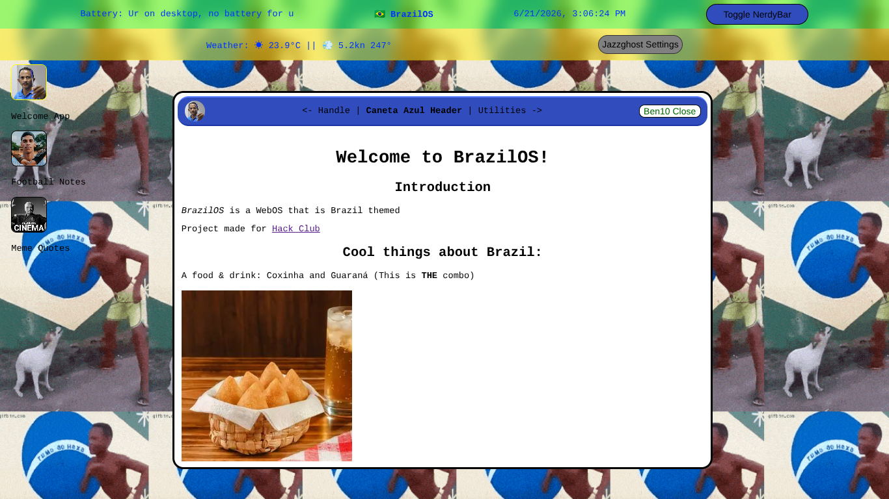

# BrazilOS
BrazilOS is a WebOS project made with funny and learning intention in mind.

## Preview
**Welcome view:**

## Functionalities
* **Working apps and functions** like weather, clock and quotes
* **Draggable windows** just like an actual OS
* **Lots of national memes and references** because that's the best part
* **Potential** to evolve to something bigger (I hope to do it in WebOS 2 project)

## Why Brazil?
Because it's my country and mecause it's a place with lots of memes and funny things, jokes and references I could make. And also because of the World Cup that is happening right now. I hope Brazil wins it (although I don't truly believe it).

## Set up locally
1. Clone repo
2. Open index.html with your browser
Yeah, that's it (what did you expect from a static page?)